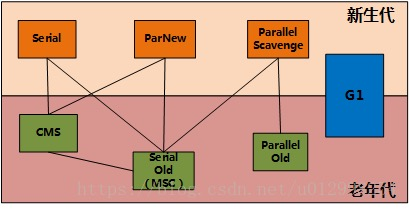
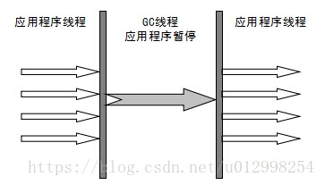
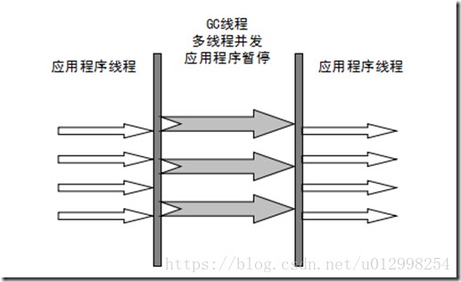
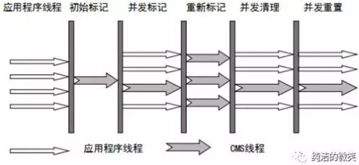

# JVM垃圾回收器

 Serial、ParNew、Parallel Scavenge、Serial Old、Parallel Old、CMS、G1；

+ 新生代收集器：Serial、ParNew、Parallel Scavenge；
+ 老年代收集器：Serial Old、Parallel Old、CMS；
+ 整堆收集器：G1；

`*`两个收集器间有连线，表明它们可以搭配使用：
>Serial/Serial Old
>Serial/CMS
>ParNew/Serial Old
>ParNew/CMS
>Parallel Scavenge/Serial Old
>Parallel Scavenge/Parallel Old
>G1

## Serial(分代回收 new-单线程-复制算法 old-单线程-标记整理算法)

> 单线程收集器, 分代进行垃圾回收
> 回收时必须暂停服务
> 参数-XX:UseSerialGC设置使用
`*`比较陈旧 JDK5默认, GC会暂停程序,不适合做服务端
`*`单核CPU优势,没有线程交互的开销
##ParNew(new-多线程-复制算法 old-单线程-标记整理算法)
ParNew/Serial Old 组合图

>多线程版本的Serial 
> 使用参数:
> -XX:+UseConcMarkSweepGC"：指定使用CMS后，会默认使用ParNew作为新生代收集器；
>-XX:+UseParNewGC"：强制指定使用ParNew；
>-XX:ParallelGCThreads"：指定垃圾收集的线程数量，ParNew默认开启的收集线程与CPU的数量相同；
`*`ParNew收集器是许多运行在server模式下的虚拟机中首选的新生代收集器，一个重要的原因是，只有ParNew和Serial收集器能和CMS收集器共同工作。无法与JDK1.4中存在的新生代收集器Parallel Scavenge配合工作，所以在JDK1.5中使用CMS来收集老年代的时候，新生代只能选择ParNew和Serial。
随着CPU核数增加  ParNew的性能会大于Serial
## Parallel Scavenge(new 多线程-复制算法)
> 控制程序达到一个可空的吞吐量
> 使用参数:
> -XX:UseAdaptiveSizePolicy参数启用Parallel Scavenge
>-XX:MaxGCPauseMillus参数控制垃圾停顿时间
> -XX:GCTimeRatio参数控制吞吐量
`*`虚拟机会根据当前系统的运行情况收集性能监控信息，动态调整这些参数以提供最合适的停顿时间或者最大吞吐量（GC自使用的调节策略）。自适应调节策略也是Parallel Scavenge收集器和ParNew收集器一个重要的区别。

## Serial Old(old-单线程-标记整理)
Serial收集器的old版本

收集器的意义在于给Client模式下的虚拟机使用。如果在Server模式下，那么它主要有两大用途：一种是在jdk1.5以及之前的版本中与Parallel Scavenge收集器搭配使用，另一种用途是作为CMS收集器的后预案，在并发收集发生Concurrent Mode Failure时使用。

## Parallel Old(old-多线程-标记整理算法)
Parallel Scavenge的old 版本
`*`这个收集器在jdk1.6中才开始提供的，直到Parallel Old 收集器出现后，“吞吐量优先”收集器终于有了比较名副其实的应用组合，在注重吞吐量以及CPU资源敏感的场合，都可以优先考虑Parallel Scavenge加 Parallel Old收集器

## CMS(old-多线程-标记清除)
一种以获取最短回收停顿时间为目标的收集器。目前很大一部分的java应用集中在互联网站或者B/S系统的服务端上，这类应用尤其重视服务的响应速度，希望系统停顿时间最短，以给用户带来较好的体验。CMS收集器就非常符合这类应用的需求。CMS收集器是基于“标记-清除”算法实现的，主要分为4个步骤。

+ **初始标记（CMS inital mark）**：需要“stop the world”，但只标记一下GC Roots能直接关联的对象，速度很快。
+ **并发标记（CMS concurrent mark）**：是GC Roots Tracing的过程，花费时间长
+ **重新标记（CMS remark）**：*需要“stop the world”，是为了修正并发标记期间因用户程序继续运行而导致标记产生变动的那一部分对象的标记记录，这个阶段时间一般会比初始标记阶段稍长一些，但远比并发标记的时间短。
+ **并发清除（CMS concurrent sweep）**：是并发清除无用对象。
##### 缺点：
+ CMS收集器对CPU资源非常敏感。在并发阶段，它虽然不会导致用户线程停顿，但是因为占用了一部分CPU资源而导致应用程序变慢，总吞吐量就会降低。CMS默认启动的回收线程数为(CPU数量+3)/4。当CPU的个数少于2个的时候，CMS对用户程序的影响可能会变得很大。
+ CMS收集器无法处理浮动垃圾（floating garbage），可能会出现concurrent mode failure导致另一次full gc的产生。在CMS的并发清理阶段，由于程序还在运行，垃圾还会不断产生，这一部分垃圾出现在标记过程之后，CMS无法在本次收集中处理掉它们，只好留到下一次GC再处理。这种垃圾称为浮动垃圾。同样由于CMS GC阶段用户线程还需要运行，即还需要预留足够的内存空间供用户线程使用，因此CMS收集器不能像其他收集器那样等到老年代几乎完全被灌满了再进行收集而需要预留一部分空间提供并发收集时的程序运作使用。默认设置下 CMS收集器在老年代使用了68%的空间后就会被激活。这个值可以用-XX:CMSInitiatingOccupancyFraction来设置。要是CMS运行期间预留的内存无法满足程序需要，就会出现concurrent mode failure，这时候就会启用Serial Old收集器作为备用进行老年代的垃圾收集。
+ 空间碎片过多（标记-清除算法的弊端），CMS是基于标记-清除算法来实现的回收器，提供-XX:+UseCMSCompactAtFullCollection参数，应用于在FULL GC后再进行一个碎片整理过程。-XX:CMSFullGCsBeforeCompaction,多少次不压缩的full gc后来一次带压缩的。
>使用参数
> -XX:+UseConcMarkSweepGC 使用CMS收集器
> -XX:+ UseCMSCompactAtFullCollection Full GC后，进行一次碎片整理；整理过程是独占的，会引起停顿时间变长
> -XX:+CMSFullGCsBeforeCompaction 设置进行几次Full GC后，进行一次碎片整理
> -XX:ParallelCMSThreads 设定CMS的线程数量（一般情况约等于可用CPU数量）
> 
## G1(标记整理)

G1收集器（Garbage-First）：是当今收集器技术发展的最前沿的成果之一，G1是一款面向服务器端应用的垃圾收集器。 使用G1收集器时，java堆的内存布局就与其他收集器有很大差别，它将真个java堆划分为多个大小相等的独立区域（Region），虽然还保留新生代与老年代的概念，但新生代与老年代不再试物理隔离的了，他们都是一部分Region（不需要连续）的集合。G1具备如下特点：

+ **并行与并发**：G1能充分利用多CPU、多核环境下的硬件优势，使用多个CPU（CPU或者CPU核心）来缩短Stop-The-World停顿的时间，部分其他收集器原本需要停顿java线程执行的GC动作，G1收集器仍然可以通过并发的方式让java程序继续执行。
+ **分代收集**：与其他收集器一样，分代概念在G1中依然得以保留。虽然G1可以不需要其他收集器配合就能够独立管理整个GC堆，但它能够采用不同的方式去处理新创建的对象和已经存活了一段时间、熬过多次GC的旧对象以获取更好的收集效果。
+ **空间整合**：与CMS的“标记–清理”算法不同，G1从整体来看是基于“标记–整理”算法实现的收集器，从局部（两个Region之间）上来看是基于“复制”算法实现的，但无论如何，这两种算法都意味着G1运行期间不会产生内存空间碎片，收集后能提供规整的可用内存。这个特性有利于程序长时间运行，分配大对象时不会因为无法找到连续内存空间而提前出发下一次GC。
+ **可预测的停顿**：这是G1相对于CMS的另一大优势，降低停顿时间是G1和CMS共同的关注点，但G1除了追求低停顿外，还能建立可预测的停顿时间模型，能让使用者明确指定在一个长度为M毫秒的时间片段内，消耗在垃圾收集上的时间不得超过N毫秒，这几乎已经是实时java（RTSJ）的垃圾收集器的特性了。
+ **初始标记（Initial Marking）**：标记GC Roots能够直接关联到的对象，并且修改TAMS的值，能在正确可用的Region中创建对象，这阶段需要停顿线程，而且耗时很短。
+ **并发标记（Concurrent Marking）**：从GC Roots开始堆中对象进行可达性分析，找出存活的对象，这个时间耗时比较长，但可与用户程序并行执行。
+ 最终标记（Final Marking）：为了修正和正在并发标记期间因用户程序继续运行而导致标记产生变动的那一部分没有标记记录，虚拟机将这一段对象变法记录在线程Rememberred Set logs里面，最终标记阶段需要把Remembered Set logs 的数据合并到Remembered Set中，这阶段需要停顿线程，但是可并发执行。
+ **筛选回收（Live Data Counting and Evacuation）**：对各个Region的回收截止和成本进行排序，根据用户期望的GC停顿时间来制定回收计划，这阶段可以做到和用户程序一起并发执行，但是因为值回收一部分Region，时间是用户可控制的，而且停顿用户线程将大幅度提高手机效率。